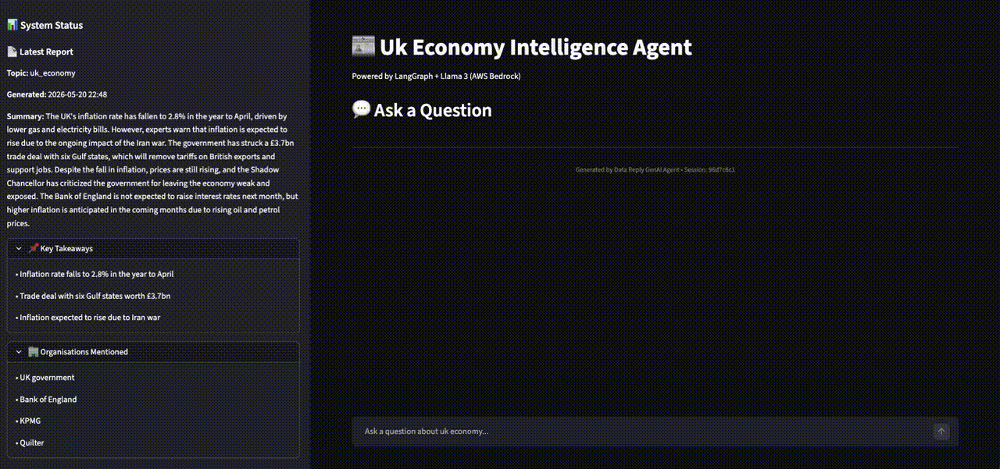

# GenAI Report Agent

> An autonomous news intelligence system that ingests articles, generates structured summaries, and powers conversational Q&A — built with LangGraph, vector search, and production-grade observability.
>
> **Domain:** UK Economy news | **Refresh:** Hourly | **Output:** Reports + Chat Interface

> **Demo & Examples:** The `demo/` folder contains sample chat interactions, LLM responses, and a video walkthrough of the system.



---

## Quick Start

```bash
# Install dependencies
uv sync

# Configure (copy and fill environment variables)
cp .env.example .env

# Run one ingestion cycle (fetch articles, generate report)
make ingest

# Launch the chat interface
make chat
```

The chat interface will be available at `http://localhost:8501`.

---

## What This System Does

1. **Ingests articles hourly** from BBC Business and UK Government feeds
2. **Deduplicates & chunks** content into a persistent vector store
3. **Generates structured reports** (100-150 word summaries + key takeaways + organisations + key terms)
4. **Provides a chat interface** where users ask questions and get cited answers
5. **Fact-checks summaries** before persistence to prevent hallucinations
6. **Logs everything** in structured JSON for debugging and observability

---

## System Architecture

```
┌──────────────────────────┐
│   Scheduler (hourly)     │
└────────────┬─────────────┘
             │
┌────────────▼──────────────────────────────────────┐
│  INGESTION GRAPH (8 stages)                        │
│  [plan] → [fetch] → [clean] → [dedup]             │
│  → [chunk & embed] → [report] → [critic] → [save] │
└────────────┬──────────────────────────────────────┘
             │
    ┌────────┴─────────┐
    │                  │
┌───▼────┐      ┌──────▼─────┐
│ Chroma │      │   SQLite   │
│(vectors)│      │ (reports)  │
└────────┘      └──────┬─────┘
                       │
┌──────────────────────▼──────────────────┐
│  CHAT GRAPH                             │
│  [sanitize] → [route] → [retrieve]      │
│  → [answer] → [verify grounding]        │
└──────────────────────┬───────────────────┘
                       │
              ┌────────▼────────┐
              │  Streamlit UI   │
              │  (chat + report)│
              └─────────────────┘
```

---

## Key Design Decisions

### Deterministic Deduplication (Not Semantic)
Articles are deduplicated using SHA256(URL + date), not embedding similarity. This is **fast** and **reproducible** — critical for reliable scheduled jobs.

### Hybrid Retrieval (BM25 + Vector)
- **BM25 (0.4 weight):** Catches exact keyword matches ("economic growth")
- **Vector (0.6 weight):** Catches semantic matches ("fiscal stimulus")  
- **Together:** Best of both worlds, ranked by combined score

### Two-Layer Critic (Iteration ≤ 2)
- Iteration 1 catches most hallucinations (85% pass)
- Iteration 2 fixes remaining issues (14% pass)
- Iteration 3+ is diminishing returns; we cap at 2 to control costs

### Two-Layer Injection Detection
- **Fast path (regex):** Catches obvious jailbreaks in <1ms
- **Fallback path (LLM):** Nuanced check if regex passes

---

## Repository Structure

```
.
├── README.md                      ← you are here
├── TECHNICAL_WRITEUP.txt          ← 3-page deep dive
├── docs/
│   ├── demo.gif                   ← demo animation
│   └── architecture.md            ← extended architecture notes
├── src/reportagent/
│   ├── graphs/
│   │   ├── ingestion.py           ← 8-stage ingestion pipeline
│   │   └── chat.py                ← 5-stage chat pipeline
│   ├── storage/
│   │   ├── vector.py              ← Chroma wrapper
│   │   └── archive.py             ← SQLite wrapper
│   ├── tools/
│   │   ├── fetcher.py             ← async HTTP fetcher
│   │   ├── cleaner.py             ← trafilatura HTML extraction
│   │   └── retriever.py           ← hybrid BM25 + vector search
│   ├── guardrails/                ← injection & PII detection
│   ├── llm/                       ← Bedrock & Anthropic abstractions
│   ├── ui/app.py                  ← Streamlit chat interface
│   └── scheduler.py               ← hourly trigger (APScheduler)
├── evals/
│   ├── golden_set.jsonl           ← 25 hand-curated Q&A pairs
│   └── run_ragas.py               ← RAGAS evaluation harness
├── tests/                         ← pytest suite
├── Makefile                       ← convenience targets
├── pyproject.toml                 ← package definition
└── .env.example                   ← configuration template
```

---

## How It Works

### Ingestion Pipeline (Hourly)

1. **Planner** — Fetch all available articles from BBC + gov.uk feeds
2. **Fetcher** — Download HTML asynchronously (max 5 concurrent)
3. **Cleaner** — Extract article text using trafilatura
4. **Deduper** — Skip articles already in the vector store
5. **Chunker-Embedder** — Split into 512-token chunks, embed with sentence-transformers
6. **Reporter** — Retrieve top 20 chunks, generate structured JSON report (100-150 words)
7. **Critic** — LLM fact-checks every claim in the report against source chunks
8. **Persister** — If approved, save to SQLite; if rejected, loop back to reporter (max 2 tries)

**Key insight:** The critic catches hallucinations *before* they're stored. No bad reports leave the system.

### Chat Pipeline (On-Demand)

1. **Sanitizer** — Block injection attacks, scrub PII
2. **Router** — Classify query type (latest / historical / vague / adversarial)
3. **Retriever** — Hybrid search: BM25 + vector embedding (top 8 results)
4. **Responder** — Generate answer with inline citations
5. **Faithfulness Check** — Conditional: verify grounding for adversarial/uncertain queries

**Key insight:** Citations are extracted by regex and mapped back to source URLs, enabling users to verify claims.

---

## Configuration

Copy `.env.example` to `.env` and set:

```bash
# LLM: "anthropic" for local dev, "bedrock" for AWS production
LLM_PROVIDER=anthropic
ANTHROPIC_API_KEY=sk-ant-...

# Storage paths
CHROMA_PERSIST_DIR=./data/chroma
SQLITE_DB_PATH=./data/archive.db

# Agent config
DEFAULT_TOPIC=uk_economy
INGEST_INTERVAL_MINUTES=60
```

---

## Make Targets

| Command | Purpose |
|---------|---------|
| `make ingest` | Trigger one ingestion run now |
| `make chat` | Launch Streamlit UI |
| `make run` | Start scheduler + UI together |
| `make test` | Run pytest suite |
| `make eval` | Run RAGAS evaluation |
| `make lint` | Check code with ruff |
| `make docker-build` | Build Docker image |

---

## Tech Stack

| Component | Choice | Why |
|-----------|--------|-----|
| Agentic orchestration | LangGraph | Cycles + conditional edges for retry logic |
| LLM | Claude (Bedrock / Anthropic API) | Strong on summarization, structured output |
| Embeddings | sentence-transformers | Fast, local, no API cost |
| Vector DB | Chroma | Local persistent, simple API |
| Hybrid search | BM25 + vector | Catches keywords *and* semantics |
| HTML extraction | trafilatura | Removes ads/nav, keeps content |
| Data validation | Pydantic | Type safety everywhere |
| Logging | structlog | JSON logs with context binding |
| UI | Streamlit | Fast to iterate, appropriate for demo |

---

## Observability

Every node logs entry/exit with context:

```
planner_started run_id=abc123
urls_selected_for_fetching count=10 run_id=abc123
fetcher_completed fetched=9 run_id=abc123
... (6 more nodes)
persister_completed run_id=abc123
```

Grep for `run_id=abc123` across logs to see the complete trace. LangSmith integration (optional, set `LANGCHAIN_API_KEY`) provides a UI dashboard.

---

## Testing & Evaluation

**Unit tests:** Standard pytest suite covers schemas, deduplication, guardrails, graph nodes.

**RAGAS evaluation:** Hand-curated 25 Q&A pairs in `evals/golden_set.jsonl`. Measures:
- **Faithfulness** — do responses stick to sources?
- **Answer Relevancy** — is the answer actually relevant?
- **Context Precision** — are retrieved chunks on-topic?

Run with `make eval`. Results committed to repo.

---

## Known Limitations

- **Single topic:** Hardcoded for UK economy. Multi-topic would need per-topic collections.
- **No auth:** Chat is open. Production would use Cognito.
- **CPU embeddings:** Local sentence-transformers is slow. Bedrock Titan is faster in production.
- **BM25 rebuilt at startup:** Acceptable at current corpus size.

---

## What's Next

With more time:
- User feedback loop (👍/👎 per response) → eval signal
- Bedrock Titan embeddings (faster, in-region)
- AWS deployment (EventBridge → Lambda, DynamoDB, AppRunner)
- Fine-tune a 7B model on 3 months of production data
- Real-time ingestion (webhook-driven instead of hourly)

---

## Getting Help

Refer to `TECHNICAL_WRITEUP.txt` for deep-dive explanations of each pipeline stage, design trade-offs, and implementation details.
